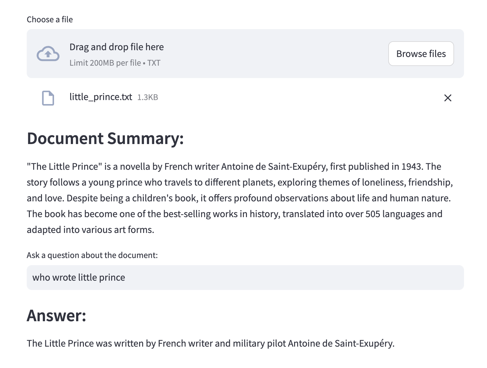
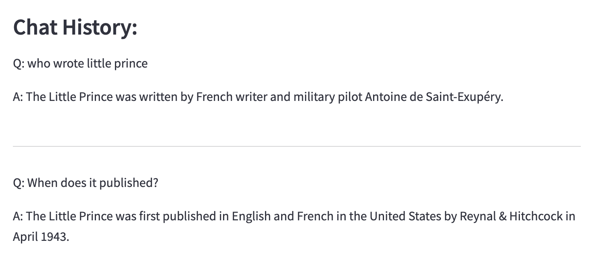

# Document Summary and Q&A Assistant

A Streamlit application powered by LangChain and GPT-3.5 that helps you:
- Generate summaries of uploaded text documents
- Ask questions about document content through an interactive chat interface

A simple Streamlit web application that uses LangChain and OpenAI's GPT-3.5 to create a chatbot interface.

## Prerequisites

- Python 3.8+
- OpenAI API key

## Installation

1. Clone this repository:
   ```bash
   git clone <repository-url>
   cd <repository-name>
   ```

2. Create and activate a virtual environment:
   ```bash
   python -m venv venv
   source venv/bin/activate  # On Windows, use: venv\Scripts\activate
   ```

3. Install the required packages:
   ```bash
   pip install -r requirements.txt
   ```

4. Set up your environment variables:
   - Create a `.env` file in the root directory
   - Add your OpenAI API key:
     ```
     OPENAI_API_KEY=your-api-key-here
     ```
   Note: Make sure not to commit your API key to version control

5. Debugging tips:
   - Ensure your OpenAI API key is properly set in the `.env` file
   - Check if the API key is being loaded correctly in `app.py`
   - If you get import errors, verify all required packages are installed
   - For StreamLit UI issues, check the browser console for errors
   - Common issues:
     - Missing API key
     - Incorrect environment variable name (should be OPENAI_API_KEY)
     - Package version conflicts

6. Run the application:
   ```bash
   streamlit run app.py
   ```

   This will start the Streamlit server and open the application in your default web browser.
   If it doesn't open automatically, you can access it at http://localhost:8501


## Example



